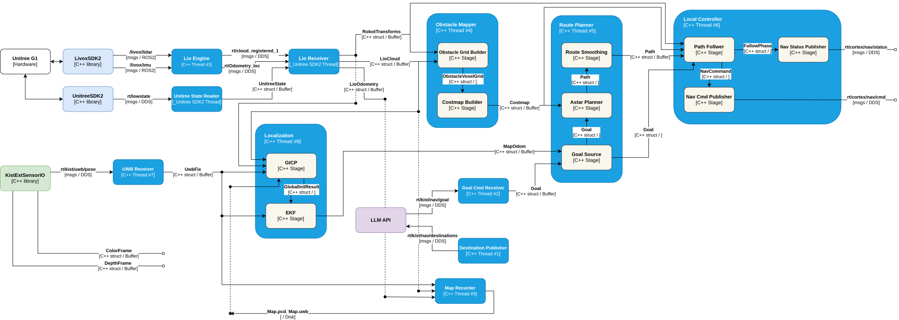

# kist-navigation-planner

C++ navigation planner for the Unitree G1 humanoid robot: LiDAR pointcloud → occupancy grid → costmap → A* path, without ROS2.

References (read-only, not imported):
- `~/route-planner` — original ROS2 pipeline (algorithm reference)
- `~/kist-gearsonic-inference` — DDS reader pattern (`UnitreeStateReader` family)

## Architecture

[](docs/kist-navigation-planner.svg)

## Dependencies

| Package | Purpose |
|---|---|
| `unitree_sdk2` | Unitree G1 DDS client library |
| `yaml-cpp` | YAML config parser |

## Installation

### Clone Repository

```bash
git clone https://github.com/Safety-Node/kist-navigation-planner.git
cd kist-navigation-planner
```

All following steps run from the repository root.

### Install unitree_sdk2

```bash
git clone https://github.com/unitreerobotics/unitree_sdk2.git thirdparty/unitree_sdk2
```

### Install yaml-cpp

```bash
sudo apt install libyaml-cpp-dev
```

## Build

```bash
cmake -B build && cmake --build build
```

## Run

## Usage
